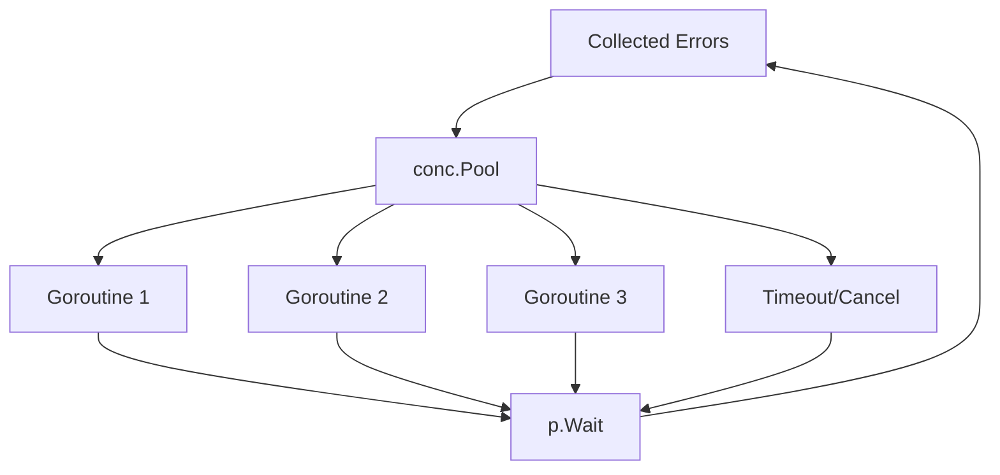

Go, concurrency konusunda güçlü bir altyapı sunar, ancak goroutine'ler, channel'lar ve wait group'larla çalışmak bazen karmaşıklaşabilir. [Sourcegraph/conc](https://github.com/sourcegraph/conc), bu karmaşayı sadeleştiren ve Go'da concurrency'yi daha erişilebilir hale getiren bir kütüphanedir. Bu yazıda, Sourcegraph/conc'un temel özelliklerini, kullanım avantajlarını ve pratik örneklerle nasıl çalıştığını açıklayacağız.

### Sourcegraph/conc Nedir?

Sourcegraph/conc, Go için geliştirilmiş, açık kaynaklı bir concurrency kütüphanesidir. Go'nun yerleşik concurrency araçlarını (goroutine'ler, channel'lar) değiştirmek yerine, bunların üzerine pratik bir katman ekler. Wait group'larla manuel koordinasyon, panic yakalama veya context entegrasyonu gibi işlemleri basitleştiren bir API sunar.

**Temel Özellikler:**

1. **Task Koordinasyonu**: Birden fazla görevi paralel çalıştırıp tamamlanmalarını bekler, panic'ler otomatik olarak yakalanır.
2. **Panic Koruması**: Goroutine'lerdeki panic'ler programın çökmesini önler ve hata olarak döndürülür.
3. **Context Desteği**: Go'nun `context` paketiyle tam uyumludur, timeout ve iptal işlemleri kolayca yönetilir.
4. **Esneklik**: Basit paralel görevlerden karmaşık iş akışlarına kadar geniş bir kullanım alanı sunar.

Backend uygulamalarında, örneğin birden fazla API'den veri çekme veya dosya işleme gibi senaryolarda, conc yönetimi kolaylaştırır.

### Neden Sourcegraph/conc Kullanmalısınız?

Go'nun concurrency modeli esnek olsa da, düşük seviyeli araçlar bazen fazla boilerplate kod gerektirir. Örneğin, `sync.WaitGroup` ile goroutine'leri koordine etmek manuel takip gerektirir ve bir panic tüm programı çökertebilir. Sourcegraph/conc, bu sorunları çözerek kodu daha sade, güvenli ve okunabilir hale getirir.

**Avantajlar:**

- **Azaltılmış Boilerplate**: Karmaşık koordinasyon pattern'lerini birkaç satırlık kodla değiştirir.
- **Güvenlik**: Panic'ler hata olarak yakalanır, uygulamanın stabilitesi korunur.
- **Okunabilirlik**: Kod daha temiz ve bakımı kolay hale gelir.
- **Performans ve Esneklik**: Küçük çaplı görevlerden büyük ölçekli iş akışlarına kadar uygundur.

### Sourcegraph/conc ile Çalışmaya Başlama

Kütüphaneyi projenize eklemek için:

```bash
go get github.com/sourcegraph/conc
```

Aşağıda, Sourcegraph/conc'un kullanımını gösteren iki pratik örnek sunuyoruz. Örnekler, Sourcegraph/conc README dokümantasyonundan ilham alınarak hazırlanmıştır.

Örnek 1: Paralel API Çağrıları ve Panic Koruması
Birden fazla API'den veri çekmek istediğinizi varsayalım. Normalde bu işlem, sync.WaitGroup, goroutine'ler ve panic koruması için ek kod gerektirir. Sourcegraph/conc ile bu süreç oldukça basittir:

```go
package main

import (
	"context"
	"fmt"
	"time"
	"github.com/sourcegraph/conc/pool"
)

func fetchAPI(ctx context.Context, endpoint string) (string, error) {
	time.Sleep(100 * time.Millisecond) // Simüle edilmiş API çağrısı
	if endpoint == "api3" {
		panic("API 3 hata verdi!")
	}
	return fmt.Sprintf("%s'den veri alındı", endpoint), nil
}

func main() {
	ctx := context.Background()
	p := pool.New().WithErrors().WithContext(ctx)

	for _, endpoint := range []string{"api1", "api2", "api3"} {
		endpoint := endpoint // Range değişkenini yakala
		p.Go(func(ctx context.Context) error {
			data, err := fetchAPI(ctx, endpoint)
			if err != nil {
				return err
			}
			fmt.Println(data)
			return nil
		})
	}

	if err := p.Wait(); err != nil {
		fmt.Printf("Hata: %v\n", err)
	}
}
```

**Kod Açıklaması:**

- `pool.New().WithErrors().WithContext(ctx)`: Bu satır, hataları toplayabilen (`WithErrors`) ve Go'nun `context` paketiyle uyumlu (`WithContext`) yeni bir görev havuzu (`pool`) oluşturur. Bu sayede görev iptalleri ve timeout'lar kolayca yönetilebilir.
- `p.Go(func(ctx context.Context) error { ... })`: Her bir API endpoint'i için bu fonksiyon ile paralel bir goroutine başlatılır. `conc` kütüphanesi, bu goroutine içinde oluşabilecek panic'leri otomatik olarak yakalar ve hata olarak döndürür.
- `p.Wait()`: Başlatılan tüm goroutine'lerin tamamlanmasını bekler. Eğer herhangi bir görev hata döndürürse veya bir panic yaşanırsa, `p.Wait()` bu hatayı döndürür.

Bu kodda, "api3" endpoint'i bir panic üretse bile `conc` bunu zarif bir şekilde yakalar. Diğer API çağrılarının sonuçları ekrana yazdırılır ve panic, programın çökmesine neden olmadan bir hata olarak raporlanır. Bu sayede, manuel `defer` veya `recover` ifadeleri kullanmaya gerek kalmaz, kod daha temiz ve yönetilebilir olur.

Örnek 2: İşçi Havuzu ile Concurrency Sınırlandırma
Büyük bir dosya kümesini işlemek istediğinizde, concurrency'yi sınırlamak faydalı olabilir. Örneğin, 100 dosyayı aynı anda değil, 5 işçiyle işlemek istiyorsunuz:

```go
package main

import (
	"context"
	"fmt"
	"github.com/sourcegraph/conc/pool"
)

func processFile(ctx context.Context, file string) error {
	fmt.Printf("%s işleniyor\n", file)
	return nil
}

func main() {
	ctx := context.Background()
	p := pool.New().WithMaxConcurrency(5).WithContext(ctx)

	files := []string{"dosya1.txt", "dosya2.txt" /* ... dosya100.txt'ye kadar */ }
	for _, file := range files {
		file := file // Range değişkenini yakala
		p.Go(func(ctx context.Context) error {
			return processFile(ctx, file)
		})
	}

	if err := p.Wait(); err != nil {
		fmt.Printf("Hata: %v\n", err)
	}
	fmt.Println("Tüm dosyalar işlendi.")
}
```

**Kod Açıklaması:**

- `WithMaxConcurrency(5)`: Bu metod, görev havuzunun aynı anda en fazla 5 goroutine çalıştırmasını sağlar. Bu, özellikle kaynakları sınırlı sistemlerde veya dış servislere yapılan çağrıları rate limit'e takılmadan yönetmek için önemlidir.
- `Context Desteği`: `WithContext(ctx)` kullanımı sayesinde, ana `context` iptal edildiğinde veya timeout'a uğradığında, havuzdaki tüm aktif ve bekleyen görevler de iptal edilir. Bu, uygulamanın kontrollü bir şekilde sonlandırılmasını sağlar.

**Sonuç:** Bu örnekte `conc`, belirlenen sınırlar dahilinde dosyaları paralel olarak işler. Kod hem sade kalır hem de sistem kaynaklarını verimli bir şekilde kullanır. `WithMaxConcurrency` özelliği, uygulamanın performansını ve stabilitesini artırmaya yardımcı olur.

Sourcegraph/conc'un Avantajları ve Kullanım Alanları
Sourcegraph/conc, Go'da concurrency yönetimini kolaylaştırarak geliştirici deneyimini iyileştirir. Kullanım alanları:

Paralel Veri İşleme: Birden fazla kaynaktan veri toplama (ör. API çağrıları).
Dosya İşleme: Büyük dosya kümelerini paralel işleme.
Hata Yönetimi: Panic ve hataları merkezi bir şekilde ele alma.
Kaynak Optimizasyonu: İşçi havuzlarıyla kaynak kullanımını sınırlandırma.
Ne Zaman Kullanmalı?
Sourcegraph/conc, basit goroutine kullanımının ötesine geçtiğinizde devreye girer. Çok sayıda goroutine koordine etmeniz, panic'lerden korunmanız veya context ile çalışmanız gerektiğinde idealdir. Performans için, WithMaxConcurrency gibi özelliklerle kaynak kullanımını optimize edebilirsiniz.

Sonuç
Sourcegraph/conc, Go'da concurrency'yi sade, güvenli ve güçlü bir şekilde yönetmek için mükemmel bir araçtır. pool, WithErrors, WithContext ve WithMaxConcurrency gibi özellikler, karmaşık concurrency senaryolarını basitleştirir. Projenizin ihtiyaçlarına göre bu kütüphaneyi kullanarak kodunuzu daha okunabilir ve sağlam hale getirebilirsiniz.

### Görev Havuzu Yapısı

Aşağıdaki Mermaid diyagramı, Sourcegraph/conc'un görev havuzunun nasıl çalıştığını görselleştirir:



## Kaynaklar:

[Sourcegraph/conc GitHub](https://github.com/sourcegraph/conc)

[Go Concurrency Dokümantasyonu](https://golang.org/doc/effective_go#concurrency)
