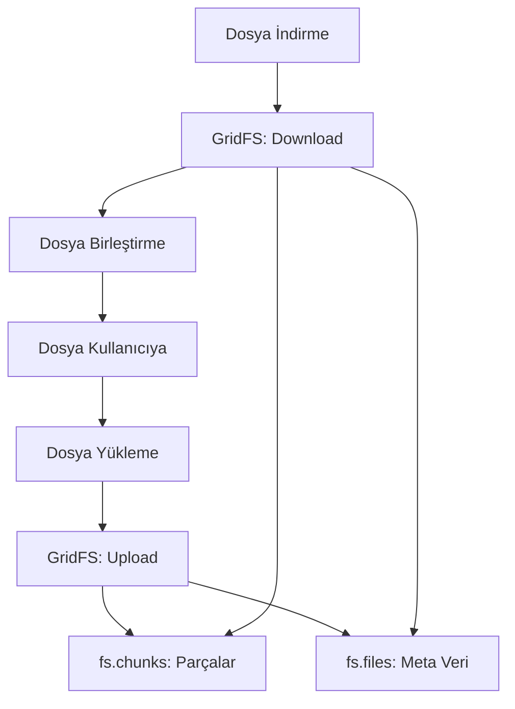

MongoDB, NoSQL veritabanı olarak belgeleri (documents) depolamak için optimize edilmiştir. Ancak büyük dosyaları (örneğin, resimler, videolar, PDF'ler) saklamak gerektiğinde 16 MB'lık belge boyutu sınırı bir engel olabilir. İşte burada **GridFS** devreye giriyor. MongoDB'nin GridFS özelliği, büyük dosyaları parçalara bölerek depolamanızı ve kolayca yönetmenizi sağlar. Bu yazıda, GridFS'in ne olduğunu, nasıl çalıştığını, avantajlarını ve Go ile kullanımını ele alacağız.

### GridFS Nedir?

GridFS, MongoDB'nin büyük dosyaları depolamak için sunduğu bir spesifikasyondur. Dosyaları 16 MB'tan büyük olsa bile, bunları daha küçük parçalara (chunks) bölerek saklar ve meta verilerle ilişkilendirir. GridFS, iki koleksiyon kullanır:

1. **`fs.files`**: Dosyaların meta verilerini (ad, boyut, yükleme tarihi, vb.) saklar.
2. **`fs.chunks`**: Dosyaların ikili (binary) parçalarını depolar, her parça varsayılan olarak 255 KB'tır.

**Temel Özellikler:**

- **Büyük Dosya Desteği**: 16 MB sınırını aşan dosyaları parçalara ayırarak depolar.
- **Esneklik**: Resimler, videolar, ses dosyaları veya herhangi bir ikili veriyi saklayabilir.
- **Entegrasyon**: MongoDB istemcileri ve sürücülerle (drivers) kolayca çalışır.
- **Ölçeklenebilirlik**: MongoDB'nin replikasyon ve sharding özellikleriyle uyumludur.

### Neden GridFS Kullanmalısınız?

MongoDB'de küçük belgeleri depolamak kolaydır, ancak büyük dosyalar için dosya sistemine güvenmek ek karmaşıklık getirir (örneğin, yedekleme, ölçeklendirme, meta veri yönetimi). GridFS bu sorunları çözer ve dosya depolamayı veritabanı içinde tutar.

**Avantajlar:**

- **Birleşik Yönetim**: Dosyalar ve meta veriler aynı veritabanında, replikasyon ve yedekleme otomatik.
- **Parçalama (Sharding)**: Büyük dosya koleksiyonları sharding ile dağıtılabilir.
- **Kolay Erişim**: MongoDB sürücüleriyle dosya yükleme, indirme ve arama işlemleri basit.
- **Meta Veri Esnekliği**: Dosyalarla ilgili özel meta veriler (ör. kategori, açıklama) eklenebilir.

---

## Go ile GridFS Kullanımı

Golang kullanarak GridFS'e dosya yükleme ve indirme işlemlerini gerçekleştirebilmek için MongoDB Go sürücüsünü ve GridFS paketini kullanıyoruz.

### Kurulum

```bash
go get go.mongodb.org/mongo-driver/mongo
go get go.mongodb.org/mongo-driver/mongo/gridfs
```

### Örnek: Dosya Yükleme ve İndirme

```go
package main

import (
	"context"
	"fmt"
	"io"
	"os"
	"time"

	"go.mongodb.org/mongo-driver/bson/primitive"
	"go.mongodb.org/mongo-driver/mongo"
	"go.mongodb.org/mongo-driver/mongo/gridfs"
	"go.mongodb.org/mongo-driver/mongo/options"
)

const (
	mongoURI = "mongodb://localhost:27017"
	dbName   = "mydatabase"
)

func connectGridFS() (*mongo.Client, *mongo.Database, *gridfs.Bucket, error) {
	ctx, cancel := context.WithTimeout(context.Background(), 10*time.Second)
	defer cancel()

	client, err := mongo.Connect(ctx, options.Client().ApplyURI(mongoURI))
	if err != nil {
		return nil, nil, nil, err
	}

	db := client.Database(dbName)
	bucket, err := gridfs.NewBucket(db)
	if err != nil {
		return nil, nil, nil, err
	}

	return client, db, bucket, nil
}

func uploadFile(filePath, filename string, metadata interface{}) (primitive.ObjectID, error) {
	client, _, bucket, err := connectGridFS()
	if err != nil {
		return primitive.NilObjectID, err
	}
	defer client.Disconnect(context.Background())

	file, err := os.Open(filePath)
	if err != nil {
		return primitive.NilObjectID, err
	}
	defer file.Close()

	uploadOpts := options.GridFSUpload().SetMetadata(metadata)
	uploadStream, err := bucket.OpenUploadStream(filename, uploadOpts)
	if err != nil {
		return primitive.NilObjectID, err
	}
	defer uploadStream.Close()

	if _, err := io.Copy(uploadStream, file); err != nil {
		return primitive.NilObjectID, err
	}

	fmt.Println("✅ Dosya yüklendi, ID:", uploadStream.FileID)
	return uploadStream.FileID.(primitive.ObjectID), nil
}

func downloadFile(fileID primitive.ObjectID, outputPath string) error {
	client, _, bucket, err := connectGridFS()
	if err != nil {
		return err
	}
	defer client.Disconnect(context.Background())

	downloadStream, err := bucket.OpenDownloadStream(fileID)
	if err != nil {
		return err
	}
	defer downloadStream.Close()

	outputFile, err := os.Create(outputPath)
	if err != nil {
		return err
	}
	defer outputFile.Close()

	if _, err := io.Copy(outputFile, downloadStream); err != nil {
		return err
	}

	fmt.Println("📥 Dosya indirildi:", outputPath)
	return nil
}

func main() {
	metadata := map[string]interface{}{
		"category":     "documents",
		"uploaded_by":  "user1",
		"upload_date":  time.Now(),
	}

	fileID, err := uploadFile("sample.pdf", "sample.pdf", metadata)
	if err != nil {
		fmt.Println("🚨 Yükleme hatası:", err)
		return
	}

	if err := downloadFile(fileID, "downloaded_sample.pdf"); err != nil {
		fmt.Println("🚨 İndirme hatası:", err)
	}
}
```

---

### GridFS İş Akışı (Mermaid Diagramı)



---

### GridFS Nerelerde Kullanılır?

- **Medya Depolama**: Büyük boyutlu resim, video veya ses dosyaları.
- **Doküman Yönetimi**: PDF, Word belgeleri gibi dosyaları meta verilerle birlikte saklama.
- **Web Uygulamaları**: Kullanıcı tarafından yüklenen içeriklerin yönetimi.
- **Veritabanı Yedekleme**: Dosyaların veritabanında tutulması sayesinde kolay yedekleme.

> **Not:** GridFS, büyük dosyaları MongoDB içinde saklamak için uygundur. Ancak çok yoğun erişim veya yüksek bant genişliği gerektiren senaryolar için CDN, Amazon S3 gibi çözümler daha uygun olabilir.

---

### Kaynaklar:

- [MongoDB GridFS Dokümantasyonu](https://www.mongodb.com/docs/manual/core/gridfs/)
- [MongoDB Go Driver](https://pkg.go.dev/go.mongodb.org/mongo-driver)
