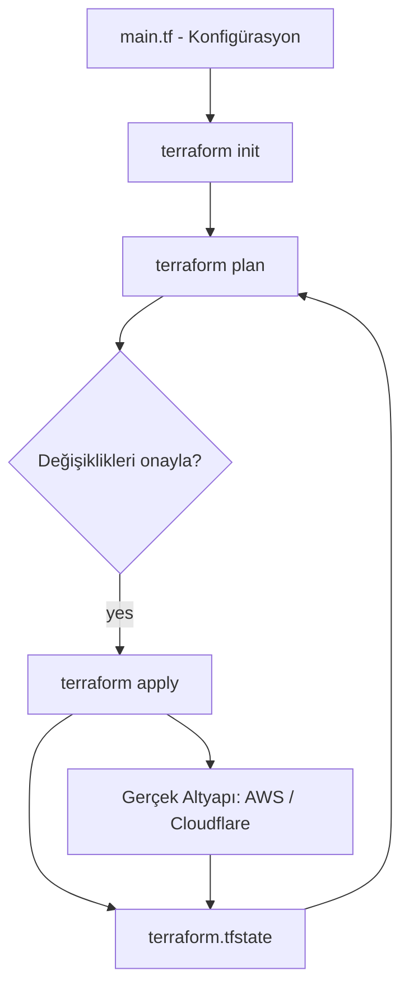

Bir sunucuyu, bir veritabanını veya bir storage bucket'ını kurmanız gerektiğinde ne yaparsınız? Çoğu zaman cevap, bir web panelinde tıklaya tıklaya ilerlemektir. Bu yöntem ilk seferinde işe yarar; ancak aynı altyapıyı ikinci kez kurmanız gerektiğinde, ya da "production ile staging neden farklı?" sorusuna cevap aradığınızda işler karışır. İşte burada **Infrastructure as Code (IaC)** devreye giriyor. Bu yazıda, IaC'nin ne olduğunu, en yaygın IaC aracı olan **Terraform**'u (ve açık kaynak alternatifi **OpenTofu**'yu), temel kavramları ve pratik örneklerle ilk konfigürasyonunuzu ele alacağız.

### Infrastructure as Code (IaC) Nedir?

IaC, altyapınızı (sunucular, ağlar, DNS kayıtları, storage, veritabanları) manuel işlemlerle değil, sürüm kontrolüne alınabilen **kod dosyaları** ile tanımlama yaklaşımıdır. Altyapınız artık panellerdeki tıklamalarla değil, okunabilir metin dosyalarıyla ifade edilir. Bu fikir araçtan bağımsızdır; AWS CloudFormation, Pulumi veya Ansible ile de uygulanabilir.

**Avantajlar:**

- **Tekrarlanabilirlik**: Aynı konfigürasyondan birebir aynı ortamı defalarca kurabilirsiniz.
- **Versiyonlama**: Altyapı değişiklikleri de tıpkı kodunuz gibi Git ile takip edilir, gözden geçirilir (review) ve geri alınabilir.
- **Dökümantasyon**: Kodun kendisi, altyapının güncel halinin canlı dökümantasyonudur.
- **Otomasyon**: CI/CD süreçlerine kolayca entegre olur.

### Terraform Nedir?

Terraform, HashiCorp tarafından geliştirilen, bulut-bağımsız (cloud-agnostic) bir IaC aracıdır. Go'nun yerleşik araçlarını değil; AWS, Google Cloud, Azure, Cloudflare gibi platformları **tek bir dil ve tek bir iş akışıyla** yönetmenizi sağlar.

**Temel Özellikler:**

1. **Declarative (Bildirimsel)**: "Şunu şöyle yap" demek yerine, **istediğiniz son durumu** tanımlarsınız. Terraform mevcut durum ile istenen durum arasındaki farkı kendisi hesaplar ve gerekli adımları uygular.
2. **HCL (HashiCorp Configuration Language)**: Okunması kolay, JSON'a benzeyen ama insan dostu bir konfigürasyon dili kullanır.
3. **Provider Mimarisi**: Yüzlerce platformla aynı araç üzerinden çalışır; her platform bir "provider" eklentisiyle gelir. AWS, GCP, Azure, Cloudflare, Kubernetes, GitHub, Datadog... liste neredeyse sonsuz. Yani Terraform sadece bir bulut için değil; bulut altyapısından DNS kayıtlarına, GitHub repo/organizasyon ayarlarından SaaS yapılandırmalarına kadar **API'si olan hemen her şeyi** yönetmek için kullanılır.
4. **State (Durum) Yönetimi**: Yönettiği kaynakların mevcut halini bir state dosyasında tutarak gerçek dünya ile kodunuzu senkron tutar.

> **Not (OpenTofu):** HashiCorp, Ağustos 2023'te Terraform'un lisansını açık kaynak olan MPL 2.0'dan daha kısıtlayıcı bir lisansa (BUSL) taşıdı. Buna tepki olarak topluluk Terraform'u fork'ladı ve **OpenTofu** ortaya çıktı — Linux Foundation çatısı altında, MPL 2.0 lisanslı, Terraform ile birebir uyumlu (drop-in) bir araç. Komutlar aynıdır; sadece `terraform` yerine `tofu` yazarsınız. Bu yazıdaki her şey ikisinde de aynen geçerlidir.

---

### Kurulum

Terraform tek bir binary'den ibarettir. Paket yöneticiniz ile hızlıca kurabilirsiniz:

```bash
# macOS (Homebrew)
brew tap hashicorp/tap
brew install hashicorp/tap/terraform

# Windows (winget)
winget install HashiCorp.Terraform

# Kurulumu doğrulayın
terraform version
```

### Temel Kavramlar

Konfigürasyon yazmaya başlamadan önce dört temel kavramı oturtmakta fayda var.

- **Provider**: Terraform'un belirli bir platformla (AWS, Cloudflare vb.) konuşmasını sağlayan eklentidir.
- **Resource (Kaynak)**: Yönetmek istediğiniz somut altyapı parçasıdır; bir sanal makine, bir DNS kaydı, bir storage bucket... Terraform'un temel yapı taşıdır.
- **State**: Oluşturulan kaynakların mevcut durumunun saklandığı dosyadır (`terraform.tfstate`). Kod ile gerçek altyapı arasındaki köprüdür.
- **Plan / Apply döngüsü**: Önce ne yapılacağını **görür** (`plan`), onaylarsınız, sonra **uygular** (`apply`).

---

### İlk Konfigürasyon: AWS'de Bir S3 Bucket

Klasik bir örnekle başlayalım: AWS üzerinde bir S3 bucket'ı oluşturalım. Önce AWS kimlik bilgilerinizi tanımlamanız gerekir — en kolayı AWS CLI ile:

```bash
aws configure   # Access Key, Secret Key ve bölge bilgilerini girer
```

Ardından boş bir klasörde `main.tf` dosyasını oluşturun:

```hcl [main.tf]
terraform {
  required_providers {
    aws = {
      source  = "hashicorp/aws"
      version = "~> 5.0"
    }
  }
}

provider "aws" {
  region = "eu-central-1"
}

resource "aws_s3_bucket" "ornek" {
  bucket = "acme-app-assets"

  tags = {
    Project     = "acme-web"
    Environment = "dev"
  }
}
```

**Kod Açıklaması:**

- `terraform { required_providers { ... } }`: Hangi provider'ı (`hashicorp/aws`) ve sürümünü kullanacağımızı belirtir; `terraform init` bunu baz alarak provider'ı indirir.
- `provider "aws" { region = ... }`: AWS provider'ını yapılandırır; kaynakların hangi bölgede oluşturulacağını söyler.
- `resource "aws_s3_bucket" "ornek" { ... }`: Oluşturulacak kaynağı tanımlar. `"aws_s3_bucket"` kaynak **tipi**, `"ornek"` ise Terraform içindeki **yerel adıdır** (koddan `aws_s3_bucket.ornek` ile erişilir).
- `bucket`: Bucket'ın global benzersiz adı (S3 bucket adları tüm dünyada eşsiz olmalıdır; örnekteki adı değiştirin).
- `tags`: Kaynağa eklenen, organizasyon ve maliyet takibi için kullanılan etiketler.

Konfigürasyonu hayata geçirmek için üç temel komut yeterli:

```bash
terraform init      # Provider'ları indirir, dizini hazırlar
terraform plan      # Ne yapılacağını gösterir (hiçbir şeyi değiştirmez)
terraform apply     # Onay sonrası değişiklikleri uygular
```

`plan` çıktısında `+` işareti yeni oluşturulacak bir kaynağı ifade eder:

```bash
Terraform will perform the following actions:

  # aws_s3_bucket.ornek will be created
  + resource "aws_s3_bucket" "ornek" {
      + bucket = "acme-app-assets"
      + arn    = (known after apply)
      + id     = (known after apply)
    }

Plan: 1 to add, 0 to change, 0 to destroy.
```

`apply` bittiğinde bucket AWS hesabınızda oluşur ve klasörünüzde bir `terraform.tfstate` dosyası belirir. Oluşturduğunuz her şeyi temizlemek için ise `terraform destroy` kullanılır — özellikle deneme amaçlı kaynakları açık bırakıp ücret ödememek için faydalıdır.

---

### Değişkenler ve Output'lar

Değerleri kodun içine gömmek yerine **değişken (variable)** olarak dışarı almak, konfigürasyonu yeniden kullanılabilir kılar. **Output**'lar ise oluşturulan kaynaklara dair bilgileri dışarıya verir:

```hcl [variables.tf]
variable "bucket_adi" {
  type        = string
  description = "Oluşturulacak S3 bucket'ının global benzersiz adı"
}

variable "region" {
  type    = string
  default = "eu-central-1"
}

provider "aws" {
  region = var.region
}

resource "aws_s3_bucket" "ornek" {
  bucket = var.bucket_adi
}

output "bucket_arn" {
  value = aws_s3_bucket.ornek.arn
}
```

**Kod Açıklaması:**

- `variable "bucket_adi" { ... }`: Dışarıdan değer alabilen bir girdi tanımlar; konfigürasyon içinde `var.bucket_adi` ile kullanılır.
- `default`: Değer verilmediğinde kullanılacak varsayılan (örnekte `region` için tanımlı, `bucket_adi` için zorunlu bırakıldı).
- `output "bucket_arn" { ... }`: `apply` sonrası bir değeri (burada bucket'ın ARN'i) dışarı verir; CLI çıktısında görünür ve başka modüllere aktarılabilir.

Artık `terraform apply -var="bucket_adi=acme-staging-assets"` diyerek aynı kodu farklı değerlerle çalıştırabilirsiniz.

---

### Aynı Araç, Farklı Bulut: Cloudflare R2

Terraform'un asıl gücü, **tek bir dille birden fazla platformu** yönetebilmesidir. Az önce AWS S3 oluşturduk; tamamen aynı `init → plan → apply` döngüsüyle, bu sefer Cloudflare üzerinde bir **R2 bucket**'ı oluşturalım. Değişen tek şey provider ve resource tanımı:

```hcl [main.tf]
terraform {
  required_providers {
    cloudflare = {
      source  = "cloudflare/cloudflare"
      version = "~> 4"
    }
  }
}

variable "cloudflare_api_token" {
  type      = string
  sensitive = true
}

variable "cloudflare_account_id" {
  type = string
}

provider "cloudflare" {
  api_token = var.cloudflare_api_token
}

resource "cloudflare_r2_bucket" "assets" {
  account_id = var.cloudflare_account_id
  name       = "website-assets"
  location   = "WEUR"
}
```

Kavramlar birebir aynı: provider, resource, değişkenler, plan/apply. AWS bilginiz olduğu anda Cloudflare'i (veya GCP, Azure, DigitalOcean...) öğrenmek, yalnızca yeni provider'ın resource'larını öğrenmekten ibaret hale geliyor. `sensitive = true` ifadesinin ise API token gibi hassas değerlerin Terraform çıktısında açıkça gösterilmesini engellediğine dikkat edin.

---

### Terraform İş Akışı (Mermaid Diagramı)

Aşağıdaki diyagram, Terraform'un temel çalışma döngüsünü ve state'in bu döngüdeki rolünü görselleştirir:



State, her `plan` aşamasında "kodun istediği durum" ile "gerçekte var olan durumu" karşılaştırmak için okunur; her `apply` sonrasında ise güncellenir. Döngünün kalbinde bu dosya vardır.

---

### State Yönetimi: Dikkat Edilmesi Gerekenler

`terraform.tfstate` dosyası kritik öneme sahiptir ve dikkat gerektirir.

- **Asla Git'e commit'lemeyin.** State dosyası, kaynaklarınıza dair hassas bilgiler (hatta bazen secret'lar) içerebilir. `.gitignore` dosyanıza ekleyin:

```bash [.gitignore]
# .gitignore
.terraform/
*.tfstate
*.tfstate.*
```

- **Takım çalışmasında remote backend kullanın.** Birden fazla kişi aynı altyapıyı yönetiyorsa, state'i yerel diskte değil; AWS S3, Cloudflare R2 veya Terraform/OpenTofu Cloud gibi paylaşımlı bir backend'de tutun.

> **Not:** Remote backend yalnızca state'i merkezileştirmekle kalmaz; **state locking** sayesinde iki kişinin aynı anda `apply` yapıp altyapıyı bozmasını da engeller.

Backend'in neden bu kadar önemli olduğunu ve nasıl yapılandırıldığını ayrı bir yazıda derinlemesine ele aldım: [Terraform Backend: Remote State Neden Şart?](/posts/terraform-backend)

---

### Sonuç

Infrastructure as Code, altyapıyı tıklamalarla yönetmenin getirdiği belirsizliği ortadan kaldırıp, onu **okunabilir, versiyonlanabilir ve tekrarlanabilir** bir kod tabanına dönüştürür. Bu yazıda IaC mantığını, Terraform/OpenTofu'nun temel kavramlarını ve `init → plan → apply` döngüsünü inceledik; aynı iş akışıyla hem AWS'de hem de Cloudflare'de gerçek kaynaklar oluşturduk.

Buradan sonraki adımlar için **modüller** (yeniden kullanılabilir altyapı blokları), **[remote backend yapılandırması](/posts/terraform-backend)** ve **workspace'ler** (aynı koddan birden fazla ortam) konularına göz atmanızı öneririm. Ama unutmayın: her şey, bu yazıda gördüğünüz o basit `plan` ve `apply` döngüsünün üzerine kuruludur.

### Kaynaklar:

- [Terraform Resmi Dokümantasyonu](https://developer.hashicorp.com/terraform/docs)
- [OpenTofu Dokümantasyonu](https://opentofu.org/docs/)
- [Terraform AWS Provider](https://registry.terraform.io/providers/hashicorp/aws/latest/docs)
- [Terraform Cloudflare Provider](https://registry.terraform.io/providers/cloudflare/cloudflare/latest/docs)
