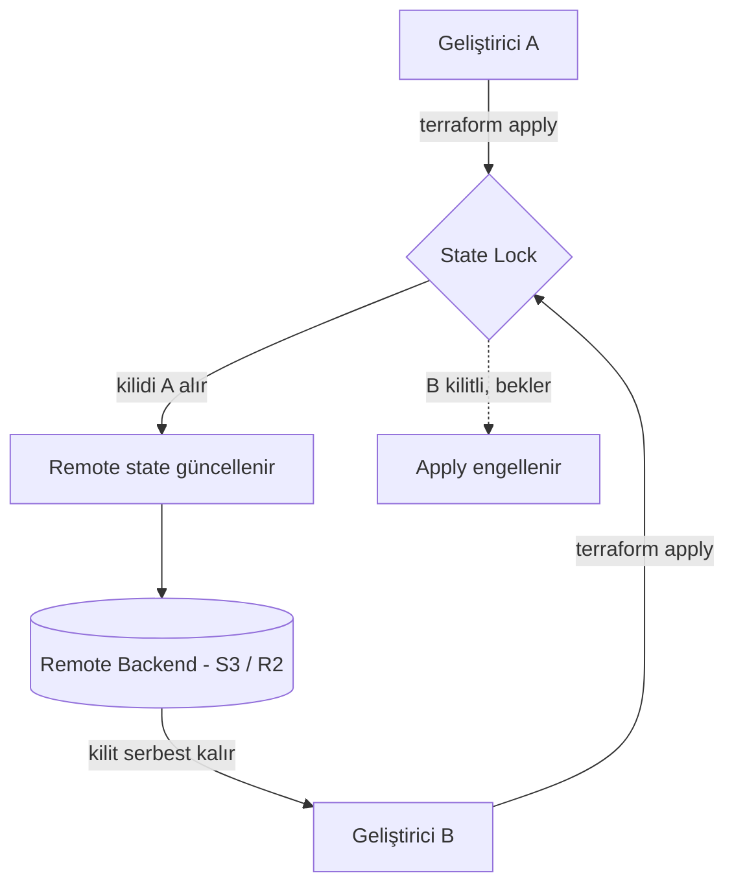

Terraform'la ilk kez `terraform apply` çalıştırdığınızda, dizininizde sessizce bir `terraform.tfstate` dosyası belirir. Tek başınıza, kişisel bir projede çalışırken bu dosyayı yerelde tutmak sorun değildir. Ama ekibe ikinci bir kişi katıldığı ya da CI/CD'ye geçtiğiniz an, bu küçük dosya en büyük baş ağrınıza dönüşebilir. Bu yazıda, Terraform backend'inin ne olduğunu, state'i neden yerelde tutmamanız gerektiğini ve remote backend'in hangi sorunları çözdüğünü ele alacağız. (Terraform'a yeni başlıyorsanız önce [Infrastructure as Code: Terraform](/posts/iac) yazısına göz atabilirsiniz.)

### Backend Nedir?

Backend, Terraform'un **state dosyasını nerede saklayacağını** belirleyen yapıdır. İki temel tür vardır:

- **Local backend (varsayılan)**: Hiçbir ayar yapmazsanız bu kullanılır. State, çalıştığınız dizinde `terraform.tfstate` olarak yerel diskte tutulur.
- **Remote backend**: State, paylaşımlı ve uzak bir konumda tutulur. Burada AWS'ye mahkûm değilsiniz — AWS S3, Google Cloud Storage, Azure Blob, Cloudflare R2, Terraform/OpenTofu Cloud ve daha fazlası desteklenir. (Aynı şekilde Terraform'un kendisi de yüzlerce sağlayıcıyla çalışır; AWS, GCP, Azure, GitHub, Kubernetes derken API'si olan hemen her şeyi yönetebilirsiniz.)

State ise Terraform'un **kodunuz ile gerçek altyapı arasındaki haritasıdır**. Hangi kaynağı yönettiğini, kaynakların ID'lerini ve özelliklerini buradan bilir. Yani state kaybolursa, Terraform yönettiği altyapıyı "tanımaz" hale gelir — bu yüzden nerede ve nasıl tutulduğu kritik öneme sahiptir.

### Yerel State'in Sorunları

Local backend basit ama tek kişilik bir senaryonun ötesine geçtiğiniz an çatlamaya başlar.

**Sorunlar:**

- **Ekip çalışması imkânsız**: State sizin diskinizde olduğu için takım arkadaşlarınız erişemez. Git'e koymak ise hem hassas veri sızdırır hem de sürekli merge conflict üretir.
- **State locking yok**: İki kişi (veya iki pipeline) aynı anda `apply` çalıştırırsa, state aynı anda iki yerden yazılır ve bozulur (race condition).
- **Tek nokta hatası**: Diskiniz giderse veya dosyayı yanlışlıkla silerseniz, Terraform yönettiği kaynaklarla bağını tamamen kaybeder.
- **Güvenlik açığı**: State dosyası, secret'ları (veritabanı şifreleri, API key'leri) **düz metin** olarak içerebilir; yerel diskte veya Git'te korumasız durur.

### Remote Backend Neden Şart?

Remote backend, yukarıdaki sorunların hepsini tek seferde çözer.

**Avantajlar:**

- **Paylaşımlı state**: Tüm ekip ve CI/CD pipeline'ları aynı, tek doğru state'i görür.
- **State locking**: Bir `apply` sürerken state kilitlenir; ikinci bir `apply` kilit serbest kalana kadar bekler. Eşzamanlı yazımdan kaynaklı bozulmalar imkânsız hale gelir.
- **Dayanıklılık ve versiyonlama**: Bucket versioning sayesinde state'in geçmiş sürümleri saklanır; bir hata olduğunda geri dönülebilir.
- **Güvenlik**: Encryption-at-rest ve erişim kontrolü (IAM/policy) ile secret içeren state korunur.
- **CI/CD uyumu**: Otomasyon pipeline'ları, merkezi ve güvenilir bir state üzerinden çalışır.

---

### Remote Backend Yapılandırması (AWS S3)

State'i AWS S3'te tutmak en yaygın yöntemdir. `terraform` bloğuna bir `backend` tanımı eklemeniz yeterli:

```hcl [backend.tf]
terraform {
  backend "s3" {
    bucket       = "acme-terraform-state"
    key          = "prod/terraform.tfstate"
    region       = "eu-central-1"
    encrypt      = true
    use_lockfile = true
  }
}
```

**Kod Açıklaması:**

- `backend "s3"`: State'in AWS S3'te saklanacağını belirtir.
- `bucket` / `key`: State dosyasının hangi bucket'ta, hangi yolda tutulacağını söyler. Farklı ortamları (`prod/`, `staging/`) farklı key'lerde ayırmak iyi bir pratiktir.
- `region`: State bucket'ının bulunduğu bölge.
- `encrypt = true`: State, sunucu tarafında şifrelenerek (SSE) saklanır.
- `use_lockfile = true`: S3 üzerinde bir kilit dosyasıyla **state locking** sağlar. (Bu özellik öncesinde locking için ayrı bir DynamoDB tablosu gerekiyordu; artık S3'in kendisi yetiyor.)

Backend bloğunu ekledikten sonra `terraform init` çalıştırın. Terraform, mevcut yerel state'inizi remote backend'e taşımayı teklif edecektir:

```bash
terraform init -migrate-state
```

### Aynı Mantık, Farklı Sağlayıcı: Cloudflare R2

Cloudflare R2, S3 ile uyumlu (S3-compatible) olduğu için aynı `s3` backend'ini özel bir endpoint ile kullanabilirsiniz. Böylece S3'in çıkış (egress) ücretleri olmadan aynı kurulumu elde edersiniz:

```hcl [backend.tf]
terraform {
  backend "s3" {
    bucket = "acme-terraform-state"
    key    = "prod/terraform.tfstate"
    region = "auto"

    endpoints = {
      s3 = "https://<account_id>.r2.cloudflarestorage.com"
    }

    use_lockfile                = true
    skip_credentials_validation = true
    skip_region_validation      = true
    skip_requesting_account_id  = true
    skip_s3_checksum            = true
  }
}
```

`skip_*` bayrakları, AWS'ye özgü doğrulamaları devre dışı bırakarak S3-uyumlu sağlayıcılarla çalışmayı mümkün kılar. Kavram aynı kalır; yalnızca state'in adresi değişir.

---

### State Locking Nasıl Çalışır? (Mermaid Diagramı)

Aşağıdaki diyagram, iki geliştirici aynı anda `apply` çalıştırdığında kilidin devreye girişini gösterir:



Geliştirici A kilidi aldığı sürece, Geliştirici B'nin `apply`'ı bloklanır. A işini bitirip kilidi bıraktığında, B kaldığı yerden güvenle devam eder. Bu mekanizma sayesinde state hiçbir zaman aynı anda iki yerden yazılmaz.

---

### İyi Pratikler

- **State'i asla Git'e koymayın.** `.gitignore` dosyanıza `*.tfstate` ve `.terraform/` ekleyin.
- **Versioning + encryption açın.** State bucket'ında sürüm geçmişi ve şifrelemeyi etkinleştirin.
- **Ortamları ayırın.** Her ortam (prod, staging) için ayrı bir state key'i veya workspace kullanın.
- **En az yetki prensibi.** State'e erişimi yalnızca ihtiyaç duyan kişi ve servislere, minimum yetkiyle verin.

### Sonuç

Local state, Terraform'u öğrenirken ve tek kişilik denemelerde gayet iyidir. Ama altyapınız ciddileştiği, ekip büyüdüğü veya otomasyona geçtiğiniz an, remote backend bir tercih olmaktan çıkıp **zorunluluk** haline gelir. Paylaşımlı state, locking, dayanıklılık ve güvenlik; hepsi tek bir `backend` bloğuyla gelir. Bu küçük yatırım, ileride yaşanabilecek "state bozuldu" felaketlerinin önüne geçer.

### Kaynaklar:

- [Terraform Backend Yapılandırması](https://developer.hashicorp.com/terraform/language/backend)
- [S3 Backend Dokümantasyonu](https://developer.hashicorp.com/terraform/language/backend/s3)
- [OpenTofu Backend Dokümantasyonu](https://opentofu.org/docs/language/settings/backends/configuration/)
- [Cloudflare R2 — Terraform State Backend](https://developers.cloudflare.com/r2/api/s3/api/)
